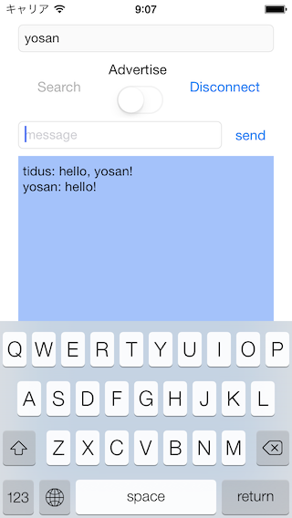

YSNBluetoothChat
================

This is a very simple application using MultipeerConnectivity framework.
You can chat with someone via bluetooth.

# How to use

### Host member

1. Input display name.
2. Click "Search" button and open invitation view.
3. Select advertising members to invite.
4. Confirm their states become "Connected".
5. Click "Done" button to close ivitation view.
6. Edit message and "send" button.

### Guest member

1. Input display name.
2. Turn on "Advertise" switch to start advertising.
3. When host member invite you, connection request is shown on popup view.
4. Select "Accept" button.
5. Edit message and "send" button.

# Points to use MultipeerConnectivity framework

### Project Settings

Add MultipeerConnectivity.framework.

### MCSession

You can exchange text, image, and other data via this class object.
Events relating to MCSession can be handled by delegate MCSessionDelegate implemented.

### MCBrowserViewController

This is a standard view to search peers to connect.
If advertising peers exist, they are listed on this view.
You can send invitation request by clicking peers' display name.
When invited peer accepts your request, its peer's state changes to "Connected".

### MCAdvertiserAssistant

You can control advertising by this object sending "start" and "stop" message.
If host member invite you, connection request is shown on popup view.

Please use this sample for your great apps!!
